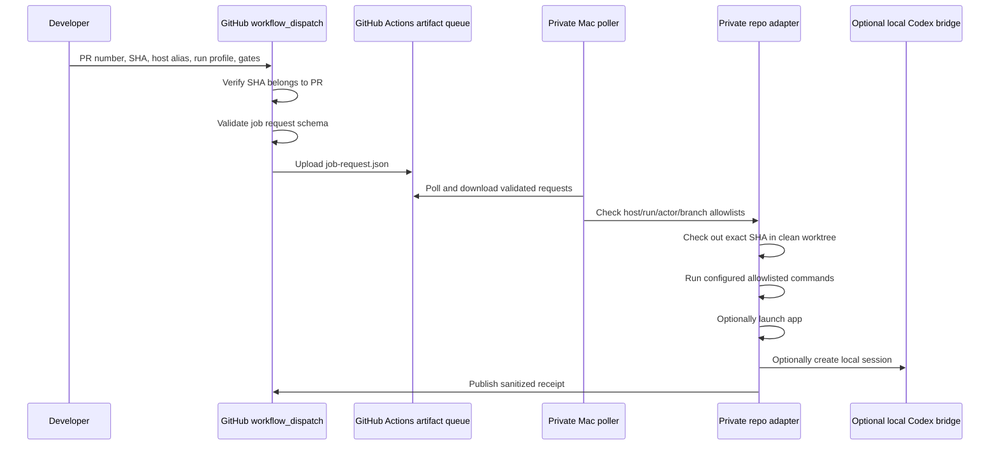

# Manual Remote PR Session

Manual Remote PR Session is a public contract for asking a predefined private Mac to test an exact pull request commit. It is intentionally pull-based: GitHub creates a validated job request artifact, and the remote Mac polls for accepted work through a private adapter. The public repo contains only generic templates, schemas, validators, and operating rules.

## Goals

- Let a developer manually run `workflow_dispatch` from a PR and name the PR number, exact SHA, host profile alias, and run profile.
- Ensure the remote Mac checks out the exact SHA from that PR before running any configured command.
- Support test-only, app-launch, and local Codex-assisted manual testing modes as independent gates.
- Produce sanitized proof receipts with PR, SHA, host profile alias, command classes, results, and artifact allow/withhold decisions.
- Keep merge-queue automation separate. This feature starts as a manual lane only.
- Design physical iPhone support as a gated extension, disabled by default.

## Non-Goals

- No public product adapters, bundle identifiers, runner labels, signing teams, device names, local paths, or command inventories.
- No inbound webhook or LAN listener on the remote Mac.
- No arbitrary shell command input from GitHub workflow fields.
- No automatic merge-queue trigger in v1.
- No default physical-device access.

## Architecture



The public workflow is only a request factory. The remote Mac remains responsible for final acceptance because it owns local state, signing context, app launch permissions, and artifact policy.

## Public Workflow Template

Use [templates/github-actions/manual-remote-pr-session.yml](../templates/github-actions/manual-remote-pr-session.yml) in a private app repo. It:

- runs only through `workflow_dispatch`;
- accepts `pr_number`, `sha`, `host_profile_alias`, `run_profile`, `launch_app`, `create_codex_session`, `codex_session_surface`, `codex_session_fallback`, `codex_required_capabilities`, `codex_instructions`, and `artifact_mode`;
- verifies the SHA is one of the PR commits using the GitHub API;
- writes `artifacts/manual-remote-pr-session/job-request.json`;
- validates that request with `aak validate-manual-remote-job`;
- uploads the JSON as a GitHub Actions artifact for private pollers.

The workflow does not run product tests, does not use a self-hosted runner, does not launch an app, does not start Codex, and does not touch devices.

## Private Adapter Contract

Private repos add a `manualRemotePrSession` adapter section. The public example documents the field names; real values stay private.

Required private responsibilities:

- map `hostProfileAlias` to one approved local host profile;
- map `runProfile` to allowlisted commands with timeouts;
- reject requests whose actor, PR base, repository, SHA, or host alias is not allowed;
- create a clean checkout or worktree at the exact SHA;
- publish one sanitized receipt per accepted request;
- never run command strings supplied by workflow input;
- store raw logs and screenshots only where the private evidence policy permits.

## Menu Bar App Smoke Pattern

Menu bar apps often do not expose a normal main window after launch. A private run
profile for this kind of app should prove the first usable surface in phases
instead of assuming a screenshot or window tree is always available.

Recommended private phases:

1. Run the configured test command.
2. Build the app bundle that will be launched.
3. Launch the app through an allowlisted private command.
4. Prove the app process is running from the checked-out PR build.
5. Optionally run UI automation diagnostics for status items, popovers, windows,
   screenshots, or accessibility state.
6. Clean up the launched process and temporary private artifacts.

Only phases 1 through 4 should be required unless the private adapter has a stable
host-specific UI automation proof. Treat menu bar item counts, click attempts,
popover counts, screenshots, and accessibility inspection as diagnostics until
they are repeatable in the same execution context as the receiver, such as a
LaunchAgent. A check that passes in an interactive shell but flakes under the
receiver should not be the required proof.

Public receipts should describe the proof scope precisely. For example, a
menu-bar smoke profile may report that tests passed, the app built, launch
succeeded, and the app process was observed. It must not claim rendered-screen or
popover verification unless the adapter actually proved that surface during the
run.

Keep profile output receipt-safe:

- use stable command IDs and command classes such as `test`, `build`,
  `launch`, and `ui-smoke`;
- print sanitized phase names, counts, exit codes, and pass/fail statuses;
- keep raw stdout, stderr, screenshots, accessibility trees, window titles,
  local paths, account content, and device identifiers out of public receipts;
- record UI automation limitations as withheld artifacts or diagnostic notes
  rather than failing the run when those checks are not part of the required
  proof.

## Job Request Schema

The request schema lives at [schemas/manual-remote-pr-session.job-request.schema.json](../schemas/manual-remote-pr-session.job-request.schema.json). A valid request includes:

- `requestId`, `schemaVersion`, and `kind`;
- repository full name, PR number, PR URL, and exact commit SHA;
- sanitized `hostProfileAlias` and `runProfile`;
- boolean action gates for tests, app launch, Codex session creation, and physical device use;
- optional Codex instructions with bounded length, requested surface, fallback policy, and desktop capability requirements;
- artifact mode and allowlist globs;
- workflow requester and validation metadata.

Use:

```bash
python3 scripts/aak.py validate-manual-remote-job templates/manual-remote-pr-session.job-request.example.json --json
```

## Codex-Session Bridge Design

The Codex bridge is a private local adapter feature. The public job request can ask for a session, but the remote Mac decides whether to create one.

The request distinguishes three Codex surfaces:

- `cli`: create a local CLI/app-server-style Codex session that can be resumed or prompted by private tooling. This is useful for proof review and follow-up prompts, but it is not proof that a visible Codex Desktop sidebar session exists.
- `desktop-open`: open the exact checkout in Codex Desktop and record that handoff. This is useful when a human wants the app focused on the PR workspace, but it does not guarantee prompt injection.
- `desktop-session`: create a visible Codex Desktop session and deliver the prompt there. Use this when the PR needs Desktop-only capabilities such as Computer Use or browser-driven manual testing. Private adapters must fail or fall back according to `codexSession.fallbackPolicy` if they cannot prove this surface.

`codexSession.requiredCapabilities` can list `computer-use` and/or `browser-use`. Capability requirements imply `desktop-session`; validators reject capability requests for `cli` or `desktop-open` surfaces.

For backward compatibility with existing `manual-remote-pr-session/v1` private adapters, the new receipt surface fields are optional as a group. Legacy receipts without them remain valid. Once a receipt includes any surface field, it must include the full surface set and pass the consistency checks.

Bridge flow:

1. Poller accepts a validated job and checks out the exact SHA.
2. Adapter writes a local session envelope containing the request ID, PR number, SHA, run profile, command results so far, artifact policy, and custom instructions.
3. Adapter redacts secrets and strips raw logs before putting content into the Codex instruction file.
4. Adapter invokes the private Codex launcher configured for that host profile and requested surface.
5. Receipt records `codexSession.created`, a sanitized local session reference or digest, requested and created surfaces, fallback use, capabilities requested and available, and whether custom instructions were used.

The public contract does not assume a specific Codex CLI or desktop integration. Private adapters can implement the bridge with a local command, a desktop deep link, a queued instruction file, or a supported Desktop app API. Receipts must not label a CLI/app-server session as `desktop-session` unless the adapter has evidence that the session is visible and usable in Codex Desktop.

## Receipt Model

The receipt schema lives at [schemas/manual-remote-pr-session.receipt.schema.json](../schemas/manual-remote-pr-session.receipt.schema.json). Receipts should be posted back to GitHub as a check run, PR comment, or private storage link according to the repo policy.

A sanitized receipt records:

- repository, PR number, exact SHA, request ID, and host profile alias;
- started and completed timestamps;
- accepted/rejected/final result;
- command IDs, command classes, sanitized summaries, durations, exit codes, and per-command result;
- app launch and Codex-session outcomes when requested, including requested/created Codex surface and any fallback;
- allowed artifacts with labels, relative paths or storage IDs, hashes, and sizes;
- withheld artifacts with reasons;
- redaction notes.

Receipts must not contain raw stdout, raw stderr, literal private shell commands, access tokens, private keys, hostnames, serial numbers, UDIDs, local usernames, or absolute local paths.

Use:

```bash
python3 scripts/aak.py validate-manual-remote-receipt templates/manual-remote-pr-session.receipt.example.json --json
```

## Safety Model

- Pull only: the remote Mac polls GitHub artifacts and never opens an inbound webhook.
- Exact SHA: the workflow verifies the SHA belongs to the PR, and the private adapter verifies it again before checkout.
- Two-step acceptance: GitHub validates request shape; the private adapter validates host, actor, branch, repo, run profile, and local readiness.
- Command allowlist: only private adapter commands can run.
- Separate gates: tests, app launch, Codex session creation, and physical device access are independent booleans.
- Evidence minimization: the default artifact mode is `receipt-only`; allowed artifacts require private allowlist globs.
- Sanitized receipts: receipts include proof metadata without raw logs, secrets, host identifiers, or local paths.
- Lease and concurrency: the poller must claim a request before running it and must publish timeout or rejection receipts.
- Merge queue separation: merge-queue automation can reuse receipt contracts later, but it must use a different workflow and stricter policy.

## Physical iPhone Extension

Physical iPhone support is designed but disabled by default. To enable it privately, require:

- `actions.physicalDevice` set to `true`;
- `gates.physicalDeviceApproval` set to `explicit-private-approval`;
- an `approvalRef` recorded in the request and receipt;
- a host profile with a private device policy;
- a stricter artifact policy that withholds screenshots unless explicitly approved;
- receipt validation that states physical device actions were requested and approved.

Public templates and examples keep `physicalDevice` false.

## First Dogfood Plan: Private Remote Mac

1. Create a private adapter branch for the first remote Mac with one sanitized host alias, one test-only run profile, and `enabled: false`.
2. Install the private poller in dry-run mode. It should download job requests, validate them, and publish rejected or dry-run receipts without checkout.
3. Enable checkout-only mode for one internal PR. Verify the poller checks out the exact SHA and emits a receipt with no command execution.
4. Enable the unit-test run profile. Keep artifact mode at `receipt-only` and confirm command IDs, durations, exit codes, and withheld artifact reasons appear in the receipt.
5. Enable app launch for one sterile smoke profile after test receipts are stable.
6. Enable Codex-session creation with a short custom instruction prompt. Confirm the receipt includes only a session digest or sanitized reference.
7. Keep physical iPhone support disabled until a separate private approval and evidence policy review is complete.

Dogfood success is three consecutive manual PR sessions with exact-SHA checkout, deterministic command selection, sanitized receipts, and no private host or artifact leakage.
